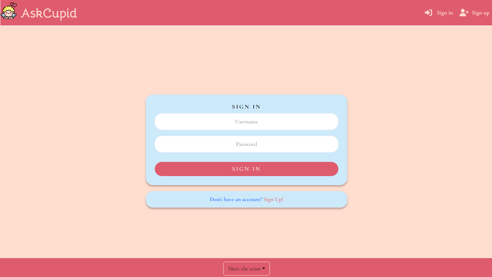

# Welcome to Ask Cupid :heart:

# Team2's Hackathon App

Welcome to Team2's app for the Hackathon competition — an extraordinary venture that aims to elevate your connections and redefine your gifting experiences. Our app goes beyond the ordinary, providing tailored suggestions for both gifts and dreamy holiday destinations.

**Introducing Ask Cupid!** Your ultimate companion for creating unforgettable moments. Whether you're searching for the perfect gift or planning a dreamy holiday, Ask Cupid is here to inspire and guide you.

## What Ask Cupid Offers:

- **Tailored Gift Suggestions:**

  - Receive personalized recommendations for gifts that will leave a lasting impression.

- **Dreamy Holiday Destinations:**
  - Explore curated suggestions for unforgettable holiday destinations, designed just for you.

## How to Get Started:

What are you waiting for? Sign up now, enter your partner's information, and let Ask Cupid be the catalyst for your next unforgettable experience. Embrace the journey, connect deeply, and make every moment count!

**Ready to create magic? Join us and let's make this Hackathon a journey to remember!**

# Content

**Table of content:**

- [Introduction](#introduction)
- [UX](#ux)
  - [The Strategy](#the-strategy)
  - [The Scope](#the-scope)
  - [The Structure](#the-structure)
  - [The Skeleton](#the-skeleton)
  - [The Surface](#the-surface)
- [User Experience](#user-experience)
  - [First Time User](#first-time-user)
  - [Returning User](#returning-user)
  - [Frequent User](#frequent-user)
  - [Design](#design)
- [Features](#features)
  - [The Landing Page](#landing)
  - [The Sign Up Page](#signup)
  - [The Sign In Page](#signin)
  - [The Question Page](#question)
- [Technical Build Overview](#technical-build-overview)
  - [Serverless Functions for Sensitive API Calls](#serverless-functions-for-sensitive-api-calls)
  - [User Registration and Login](#user-registration-and-login)
  - [Data Models](#data-models)
- [Agile Approach to Development](#agile-approach-to-development)
- [Technologies](#technologies)
  - [Language](#languages)
  - [Tools](#tools)
  - [Frameworks & Libaries](#frameworks-libaries)
- [Testing](#testing)
  - [Manual Testing](#manual-testing)
  - [Lighthouse](#lighthouse)
  - [Browser Test](#browser-test)
  - [Validation](#validation)
  - [Bugs](#bugs)
- [Deployment](#deployment)
  - [Deployment To Github](#deployment-to-github)
  - [Deployment to Heroku](#heroku-deployment)
- [Credit](#credit)
  - [Content](#credit-content)
  - [Images](#images)
  - [Thank You](#thank-you)
- [The Team](#team)

## UX

### The Strategy

- The primary goal of the Ask Cupid app's initial version is to enhance romantic connections through a strong emphasis on detailed partner profiles.
- The strategy centers around providing users with a platform to create comprehensive profiles that reflect their personalities, interests, and relationship preferences.
- This approach aims to lay the foundation for meaningful and personalized interactions, setting the stage for deeper connections.

### The Scope

- The core scope of the first version revolves around users creating detailed profiles specifically for their partners.
- Users are encouraged to share comprehensive information about their partners, fostering a more profound understanding of their personalities and preferences.
- While the initial release focuses on text-based interactions, future iterations may extend to incorporate multimedia elements for a richer user experience.

### The Structure

- The app structure prioritizes the creation of detailed partner profiles as the central feature.
- User-friendly interfaces guide users through the partner profile creation process, ensuring a seamless and enjoyable experience.
- Conversation starters and personalized suggestions complement the partner profile-centric structure, offering avenues for engaging interactions.

### The Skeleton

- Wireframes were crafted with a strong emphasis on the partner profile creation process, ensuring a user-friendly and intuitive design.
- The wireframes provide a strategic visualization, highlighting the importance of detailed partner profiles in the app's structure.

  - [View More Wireframes](src/assets/wireframes)

  
   

- Here's our system architecture diagram, illustrating the overall flow and components of the Ask Cupid app's backend. This diagram provides a high-level view of how different parts of the system interact.

- [View Diagram In Detail](src/assets/images/askcupid_erd.png)

  

### The Surface

### Technology Stack

The Ask Cupid app is built using a modern and robust technology stack, combining the power of React and Django to deliver a seamless and feature-rich user experience.

- **Frontend:** Developed with React, the app boasts a clean and visually appealing interface, providing an intuitive layout for users.

- **Backend:** Powered by Django, our backend ensures the efficient processing of data, contributing to the app's commitment to facilitating genuine connections and meaningful conversations.

These technologies work in harmony to create a space where users can delve into the intricacies of their partners' personalities, building a foundation for lasting and authentic relationships.

- A modern and intuitive layout encourages users to create detailed profiles for their partners, fostering a sense of authenticity and depth in the connections made through the app.
- The decision to prioritize partner profiles underscores the app's commitment to facilitating genuine connections and meaningful conversations.
- This intentional design choice aims to create a space where users can delve into the intricacies of their partners' personalities, building a foundation for lasting and authentic relationships.

# User Experience

### First Time User

- **Easy Signup:**
- As a first-time user, I'd like to easily see where I can sign up so I can get started.
  There should be a prominent and easily accessible "Sign Up" button on the landing page.
  The sign-up process should be straightforward with clear instructions.
  Minimal required information during sign-up to encourage a quick and hassle-free onboarding experience.

- **Welcoming Atmosphere:**
- As a first-time user, I'd like to feel welcomed to the site so I'd feel the desire to come back.
  The landing page should feature a warm and inviting design with visually appealing elements.
  Upon successful sign-up, the user should receive a personalized welcome message or prompt.
  Clear navigation cues and tooltips should guide the user to explore key features and sections.

- **Instructions:**
- As a first-time user, I'd like instructions on what to do so I can get started quickly.
  Provide an onboarding tutorial or guide that highlights key features and how to navigate the app.
  Include tooltips or pop-ups explaining the purpose of each section or button.
  Offer a "Getting Started" section with concise instructions on creating the first partner profile and initiating a conversation.

### Returning User

- As a returning user, streamlining the login and password reset process would significantly elevate my experience:

- **Effortless Login:**
- A clear and easily accessible "Sign In" button on the landing page would make logging in a breeze. Having a familiar spot to enter my credentials ensures a quick and straightforward start to my session.

- **Password Reset Made Simple:**
- In case I forget my password, having a prominent "Forgot Password?" link right alongside the login area would be incredibly helpful. A hassle-free password reset process ensures I'm not stuck and can swiftly regain access to my account.

- **Secure Account Management:**
- It's reassuring to know that managing my account settings is straightforward. Whether it's updating personal information or adjusting privacy controls, having these options easily accessible ensures I'm in control of my account's security and privacy.

- **Previous Profiles:**
- As a returning user, I'd like to see the results for my previous profiles so I can reflect on past .
  Provide a clear and easily accessible "View Results" or "Previous Profiles" section.
  Display a summary or detailed view of the results from past partner profiles.
  Include an option to revisit and edit previous profiles if desired.

- **My Own Profile:**
- As a returning user, I'd love to be able to input my own info as well so I can make the experience more real and personalized.
  Enable users to easily navigate to the "Create Profile" section.
  Provide an option to input and save personal information to create their own profiles.
  Allow users to switch seamlessly between creating profiles for others and creating profiles for themselves.

### Frequent User

- **More Categories:**
- As a frequent user, I'd love to see more categories so I can get a more precise result.
  Expand the range of categories available for creating partner profiles.
  Include options for specific interests, hobbies, and lifestyle preferences.
  Enhance the algorithm to provide more nuanced and precise match results based on the additional categories.

- **More Matching:**
- As a frequent user, I'd like to match myself with different partners and see which matches the best.
  Introduce a "Match Yourself" feature where users can simulate matches with various partner profiles.
  Display a compatibility score or summary for each simulated match.
  Allow users to compare results and gain insights into compatibility patterns.

- **Our Song:**
- As a frequent user, I'd like our song to be displayed so I can add a personalized touch to my interactions.
  Include an option for users to set a personalized "Our Song" for each partner profile.
  Display the chosen song prominently within the partner profile or during interactions.
  Allow users to change or update their chosen song for a dynamic and personalized experience.

### Design

- We've employed this Color Palette to create a gentle aesthetic and infuse a romantic touch into the design

 

 
 

# Features

# The Landing Page

### Welcome to Ask Cupid Landing Page
- Your first contact with Ask Cupid — where the journey begins, and things may never be the same! Here, your adventure kicks off, setting the stage for unforgettable connections and curated experiences.

### Explore Ask Cupid:

- Discover a world where genuine connections thrive, driven by personalized profiles and thoughtful interactions.
Curated Experiences:

### Dive into curated suggestions for gifts and dreamy holiday destinations, tailored just for you.
- Your Adventure Awaits:
This landing page is more than a welcome; it's a portal to an extraordinary world designed to make every moment count. Welcome to Ask Cupid, where the magic begins.

### Footer - Meet the Team:
- On every page, explore the personalities behind Ask Cupid. Meet the team in our footer, a constant presence as you navigate through your personalized journey.

### Responsive Design:
- Experience seamless interactions on all devices. Ask Cupid ensures a responsive design, providing an optimal experience whether you're on a desktop, tablet, or mobile device.

# The Sign Up Page

### Start Your Journey with Our Sign Up Page
- Embark on a seamless journey with our user-friendly Sign Up page, the gateway to a world of personalized connections and unforgettable experiences.

### Sign Up for an Account:
- If you're new here, the Sign Up feature awaits you. Create your account effortlessly and step into a realm where genuine connections and curated experiences await.
Featuring Our Outstanding Logo:

### Featuring Our Outstanding Logo:
- As you embark on this experience, you'll be greeted by our outstanding logo, symbolizing the essence of our app — a blend of style, authenticity, and connection.
This is where the magic begins, where you sign up to create moments. Our logo stands as a beacon, guiding you into an extraordinary world designed just for you.

# The Sign In Page

### Start Your Returning Journey with Our Sign In Page
- Embark on a seamless journey with our user-friendly Sign In page, your entry point to a world of personalized connections and unforgettable experiences.

### Sign In for Returning Users:

- For those returning, our Login feature is your gateway. Access your personalized space with ease, picking up where you left off in your journey.
### Featuring Our Outstanding Logo:

- As you embark on this experience, you'll be greeted by our outstanding logo, symbolizing the essence of our app — a blend of style, authenticity, and connection.
This is where the magic continues, where you log in to cherish memories. Our logo stands as a beacon, guiding you into an extraordinary world designed just for you.

# The Question Page

### Ask Cupid Question Page
- Welcome to the heart of Ask Cupid — the Question Page, where the magic happens. This is the space where you provide information about your partner, and Ask Cupid works its enchantment to turn your surprise into perfection.

### How It Works:
- Personalized Information:

- Input details about your partner, creating a comprehensive profile that reflects their personality, interests, and preferences.
### Enchanting Surprises:

- Let Ask Cupid transform the information into tailored suggestions for gifts and dreamy holiday destinations.
### Your Journey to Perfection:
- The Question Page is where connections deepen, and surprises become extraordinary. Engage with Ask Cupid to craft moments that transcend the ordinary.

# Technical Build Overview

## Serverless Functions for Sensitive API Calls

- **Deployment Platform:**
  - Netlify
- **Purpose:**
  - To securely make API calls to OpenAI's API, we utilized serverless functions deployed on Netlify. This approach enhances security by keeping sensitive API keys server-side and off the client-side code, thereby reducing exposure to potential vulnerabilities.

## User Registration and Login

- **Back End Framework:**
  - Django REST Framework (DRF) hosted on Heroku
- **Functionality:**
  - We implemented user registration and login functionality using Django DRF, providing a secure and efficient way for users to access their accounts. The Django user model is extended to support custom user data and authentication mechanisms.

## Data Models

- **User Model:**
  - Utilizes the standard Django user model for authentication and user management.
- **Account Model:**
  - Designed to store user profile information with a focus on future scalability for incorporating social media activities. It includes owner-specific permissions for update and delete operations, ensuring data integrity and security.
- **Partner Profile Model:**
  - Aims to store partner characteristics, simplifying the user experience by eliminating the need to fill out forms on each login. This model enhances the platform's usability by allowing registered users to quickly access relevant information.

# Agile Approach to Development

Due to time constraints and the ambitious scope of our project, we adopted an agile development approach, prioritizing specific features to ensure timely and effective delivery. Here's a brief overview of our development phases:

1. **Initial Focus:**

- Development began with the implementation of serverless functions on Netlify for secure OpenAI API calls, alongside the construction of the React front end and backend Django API authentication.

2. **Integration and Testing:**

- Once the OpenAI API functionality was developed and tested, it was integrated into the main React application. Concurrently, front end developers worked on styling, while back end developers focused on the account model for profile data storage.

3. **User Authentication:**

- The registration and login functionalities were implemented, allowing users to securely access their accounts. This phase also included front end enhancements for usability and aesthetics, alongside backend development for partner data storage.

4. **User Profile and Partner Info:**

- Time-permitting, additional features such as user profile management (CRU operations) and partner information storage with CRUD capabilities were planned to enrich the user experience and platform functionality.

Our agile approach ensured that we remained flexible and responsive to project needs, allowing for the prioritization of critical features while laying the groundwork for future enhancements.

# Technologies

### Languages

- **Languages used:**
- **HTML:** Used for structuring the web pages.
- **CSS:** Employed for styling and layout.
- **React:** JavaScript library utilized for building the interactive user interface.
- **Bootstrap:** Front-end framework for responsive and visually appealing design.
- **Python:** Backend programming language for server-side development.
- **Chakra UI:** React component library for building accessible and customizable UI components.

### Tools

- Balsamiq : Used for creating wireframes.
- VsCode : Used to code.
- Github : Employed for code deployment.
- Am I Responsive: Employed for testing and ensuring responsiveness.

### Frameworks & Libaries

# Testing

### Manual Testing

### Lighthouse

### Browser Test

### Validation

### Bugs

| Bug         | Status       | Description        | Steps To Resolve |
| ----------- | ------------ | ------------------ | ---------------- |
| Issue       | ~~Resolved~~ | Everythings fucked | Correct it       |
| Issue       | Ungoing      | Everythings fucked | Dont know        |
| Im a newbie | Ungoing      | I can´t do shit    | Teach me         |
